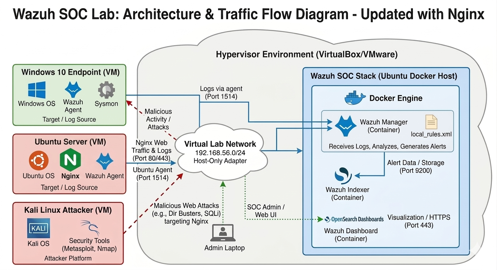

Markdown

# 🛡️ SOC Lab: Automated Threat Detection & Mitigation with Wazuh

  
  
  
  

## 📝 Project Overview
This project demonstrates the deployment of a **Security Operations Center (SOC)** environment using **Wazuh (SIEM/XDR)**. The lab is designed to detect and automatically mitigate real-world cyber attacks, such as **DDoS (HTTP Flooding)**, **SSH Brute Forcing**, and **Suspicious Windows Process Chains**, by leveraging custom detection rules and **Active Response (IPS)**.

---

## 🏗️ Lab Architecture

  
   
  <em>High-level architecture: Kali Linux (Attacker) ➔ Ubuntu/Windows (Agents) ➔ Wazuh Manager (Docker Analysis Engine).</em>

### 🛠️ Components:
* **Wazuh Manager:** Centralized engine hosted in **Docker**.
* **Ubuntu Server:** Running **Nginx** and the Wazuh Agent.
* **Windows 10:** Running **Sysmon** for advanced endpoint telemetry.
* **Kali Linux:** Attacker machine using `ab`, `curl`, and `hydra`.

---

## 🛠️ Monitoring & Hygiene

Before launching attacks, the environment was audited for baseline security and agent health.

  
   
  <em><b>Fleet Status:</b> Monitoring active connectivity for Ubuntu and Windows 10 agents.</em>

  
   
  <em><b>Threat Hunting Overview:</b> Aggregated security events dashboard ready for analysis.</em>

---

## 🚀 Attack Simulation & Detection

### 1. DDoS Attack (Nginx HTTP Flood)
Simulated a high-volume attack from Kali Linux using Apache Benchmark (`ab`).

  
   
  <em><b>Alert Triggered:</b> Rule 100210 (Level 12) detecting 100+ requests in 10 seconds.</em>

### 2. Web Vulnerability & OS Attacks

Detecting Local File Inclusion (LFI) attempts and unauthorized administrative activity.

<em><b>Events:</b> Successful detection of LFI, PAM session closures, and unauthorized sudo commands.</em>

🛡️ Automated Mitigation (Active Response)

The lab moves from detection to prevention. When the DDoS threshold is met, the Manager commands the Agent to block the attacker's IP automatically using the firewall-drop script.

<em><b>IPS Action:</b> The Active Response engine confirming the automated firewall block was executed.</em>

📈 Advanced Analytics & Compliance
MITRE ATT&CK Mapping

Alerts are mapped to the MITRE framework to visualize adversary tactics.

<em><b>MITRE Dashboard:</b> Mapping lab events to T1110 (Brute Force) and T1190 (Exploiting Public Applications).</em>

File Integrity Monitoring (FIM)

Tracking unauthorized changes to system configuration files in real-time.

<em><b>FIM Dashboard:</b> Real-time auditing of /etc/ and other critical system directories.</em>

